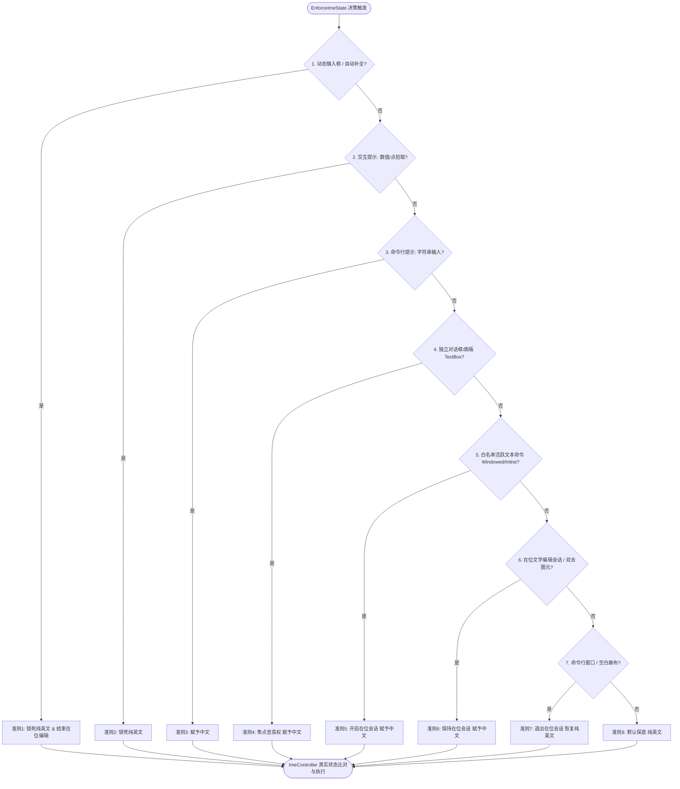

# CAD Auto IME（墨语智能输入法）技术架构与调用逻辑全景规范文档

> **版本**：v0.4.3 (Build 2026-09)  
> **所属仓库**：Auto CAD 插件 / CAD Auto IME  
> **宿主工程**：InkVerse X（墨语 X）智能套件子分项 / 独立分支插件  

---

## 目录
1. [插件定位与设计哲学](#1-插件定位与设计哲学)
2. [跨世代技术栈与多目标编译矩阵 (AutoCAD 2007~2027)](#2-跨世代技术栈与多目标编译矩阵-autocad-20072027)
3. [核心模块拓扑与职责划分](#3-核心模块拓扑与职责划分)
4. [八级状态机决策树仲裁体系 (Core Decision Tree)](#4-八级状态机决策树仲裁体系-core-decision-tree)
5. [输入法双轨控制通信引擎 (IMM32 + TSF + Layout)](#5-输入法双轨控制通信引擎-imm32--tsf--layout)
6. [事件总线与生命周期交互链路 (Event Call Graph)](#6-事件总线与生命周期交互链路-event-call-graph)
7. [关键业务场景时序分析 (Sequence Flow)](#7-关键业务场景时序分析-sequence-flow)
8. [天正/探索者等第三方构件兼容与避坑准则](#8-天正探索者等第三方构件兼容与避坑准则)

---

## 1. 插件定位与设计哲学

在 AutoCAD 的日常绘制与图纸深化中，用户面临最高频的体验痛点是：
1. **绘图区命令盲打与动态输入**：输入快捷键（如 `L`, `C`, `REC`, `TR`, `T` 等）时，输入法处于中文模式，导致命令变成拼音候选框（卡死在输入法窗口），必须按 Shift 或退格重输；
2. **文字编辑与标注录入**：进入多行文字（`MTEXT`）、单行文字（`TEXT`）、或双击文字图元（`TEXTEDIT`）时，输入法依旧是英文，用户被迫手动按 Shift 切中文；输入完退出后，又遗忘切回英文，导致下一个快捷键再次变成拼音；
3. **第三方插件弹窗**：在天正建筑、探索者、CASS、鸿业等专业插件的对话框中填写参数或文字时，输入框频繁被卡在英文或引发任务栏输入法频繁闪烁抖动。

**CAD Auto IME 的核心设计哲学**：
- **无感介入（Zero Friction）**：0 掉帧、0 鼠标卡顿、0 任务栏图标闪烁；
- **意图确立（Intent Supremacy）**：在拾取坐标、敲击命令时 **100% 纯英文**；在文字编辑、弹窗录入时 **100% 自动切中文**；
- **按键自由（Non-Intrusive）**：严禁在按键事件中拦截篡改输入法，归还用户按 `Shift` 自由切中英文的权利；
- **跨代兼容（Universal Support）**：单一代码库无缝适配 AutoCAD 2007 到 2027 全世代平台。

---

## 2. 跨世代技术栈与多目标编译矩阵 (AutoCAD 2007~2027)

插件采用 **Shared Project（共享代码核心 `OpenCadIme.Core`）+ 多版本独立启动器（Sys17~Sys27）** 的高内聚低耦合物理架构：

| 内部世代 | 适配 AutoCAD 版本号 | 目标运行时框架 (.NET) | 核心程序集引用 | UI 渲染引擎 |
| :--- | :--- | :--- | :--- | :--- |
| **Sys17** | AutoCAD 2007 ~ 2009 | .NET Framework 3.5 | `acdbmgd.dll`, `acmgd.dll` | WinForms |
| **Sys18** | AutoCAD 2010 ~ 2012 | .NET Framework 3.5 | `acdbmgd.dll`, `acmgd.dll` | WinForms |
| **Sys19** | AutoCAD 2013 ~ 2014 | .NET Framework 4.0 | `AcDbMgd.dll`, `AcMgd.dll`, `AcCoreMgd.dll` | WPF Modern |
| **Sys20** | AutoCAD 2015 ~ 2016 | .NET Framework 4.5 | `AcDbMgd.dll`, `AcMgd.dll`, `AcCoreMgd.dll` | WPF Modern |
| **Sys21** | AutoCAD 2017 | .NET Framework 4.6 | `AcDbMgd.dll`, `AcMgd.dll`, `AcCoreMgd.dll` | WPF Modern |
| **Sys22** | AutoCAD 2018 | .NET Framework 4.7 | `AcDbMgd.dll`, `AcMgd.dll`, `AcCoreMgd.dll` | WPF Modern |
| **Sys23** | AutoCAD 2019 ~ 2020 | .NET Framework 4.7.2 | `AcDbMgd.dll`, `AcMgd.dll`, `AcCoreMgd.dll` | WPF Modern |
| **Sys24** | AutoCAD 2021 ~ 2024 | .NET Framework 4.8 | `AcDbMgd.dll`, `AcMgd.dll`, `AcCoreMgd.dll` | WPF Modern |
| **Sys25** | AutoCAD 2025 | .NET 8.0 (net8.0-windows) | AutoCAD 2025 NuGet / AcCoreMgd | WPF Modern |
| **Sys26** | AutoCAD 2026 | .NET 8.0 (net8.0-windows) | AutoCAD 2026 NuGet / AcCoreMgd | WPF Modern |
| **Sys27** | AutoCAD 2027 | .NET 10.0 (net10.0-windows)| AutoCAD 2027 NuGet / AcCoreMgd | WPF Modern |

---

## 3. 核心模块拓扑与职责划分

```
OpenCadIme.Core/
├── PluginMain.cs              // 插件入口、单例管控、八级仲裁决策树、在位编辑会话仲裁
├── Interop/
│   └── Win32API.cs            // 深度 Win32 API 声明：MSAA 钩子、IMM32、TSF COM 接口、窗口类指纹识别
├── Core/
│   ├── ImeController.cs       // 双轨输入法控制通信引擎：IMM32 上下文操控、TSF 隔间直连、键盘布局同步
│   ├── CommandInterceptor.cs  // 底层 AutoCAD 命令拦截器：CommandWillStart/Ended、Editor 交互提示监听
│   ├── FocusHookManager.cs    // 操作系统级 MSAA 全局焦点雷达：EVENT_OBJECT_FOCUS 监听与句柄透传
│   ├── CadMessageFilter.cs    // AutoCAD 消息循环过滤器：PreTranslateMessage 提取、ESC 复位、安全双击
│   ├── ConfigManager.cs       // 命令白名单与用户自定义配置字典
│   └── Logger.cs              // 高性能轻量化异步诊断日志
└── UI/
    ├── ModernWpf/             // Sys19~Sys27 现代 Fluent WPF 配置界面
    └── LegacyForm/            // Sys17~Sys18 经典 WinForms 配置界面
```

---

## 4. 八级状态机决策树仲裁体系 (Core Decision Tree)

每次焦点变更、命令开始/结束、或交互提示变更时，统一调用 `PluginMain.EnforceImeState()`。按照严格且无回环的八级单向瀑布流进行裁决：



### 八级准则定义说明：
1. **准则 1【动态输入最高英文豁免权】**：
   依附于 ToolTip、AutoComplete、`acdyninput` 的任何浮动编辑框，专用于命令缩写和坐标数值输入，**100% 锁死纯英文**；
2. **准则 2【交互拾取与数值阶段】**：
   当 `activePrompt == PromptKind.NumericOrPoint`（正在拾取角点、坐标、高度、旋转角、距离或关键词选项）时，**100% 保持英文**；
3. **准则 3【命令行字符串提示】**：
   当 `activePrompt == PromptKind.StringInput`（命令行处于“输入文字:”阶段）时，**100% 放行中文**；
4. **准则 4【业务对话框与参数面板焦点最高裁决权 (Focus Supremacy)】**：
   焦点位于独立对话框（`#32770`）或浮动面板的文本控件中，判定用户意图为填表录入，**100% 赋予中文**；
5. **准则 5【白名单活跃文本命令 (MTEXT, TEXT, DHWZ, TTEXT 等)】**：
   当处于白名单文本命令中，且点拾取阶段已结束，**100% 激活在位会话并赋予中文**（杜绝因画布误判为英文）；
6. **准则 6【双击图元与真实在位编辑】**：
   刚刚双击图元或处于在位会话中，**100% 赋予中文**；
7. **准则 7【命令行窗口与空白画布】**：
   普通绘图或输入命令缩写，**100% 保持纯英文**；
8. **准则 8【默认兜底】**：
   无焦点或未知状态，**100% 保持纯英文**。

---

## 5. 输入法双轨控制通信引擎 (IMM32 + TSF + Layout)

为了兼顾 Windows 7/10/11 的不同输入法（微软拼音、微软五笔、搜狗、微信输入法等），`ImeController.cs` 实现了 **三重保障通信**：

1. **真实状态门禁 (`IsAlreadyInState`)**：
   - 检查线程键盘布局 `GetKeyboardLayout(0)`（英文 `0x0409`，中文 `0x0804`）；
   - 通过 `ImmGetContext` 获取目标窗口上下文，比对 `ImmGetOpenStatus` 和 `ImmGetConversionStatus`；
   - 只有系统当前真实状态与目标状态不符时，才触发切换；若已处于目标状态，0 耗时即刻返回，消除抖动。
2. **IMM32 经典通信轨**：
   - `ForceEnglish`：调用 `ImmSetOpenStatus(himc, false)`，并设置 `IME_CMODE_ALPHANUMERIC`；
   - `ForceChinese`：调用 `ImmSetOpenStatus(himc, true)`，并设置 `IME_CMODE_NATIVE | IME_CMODE_SYMBOL`；
   - 必须成对调用 `ImmReleaseContext`，坚决不发生句柄泄漏。
3. **TSF (Text Services Framework) 现代双轨隔间**：
   - 获取 `ITfThreadMgr` 与 `ITfCompartmentMgr`；
   - 针对 `GUID_COMPARTMENT_KEYBOARD_OPENCLOSE` 写入开关状态；
   - 针对 `GUID_COMPARTMENT_KEYBOARD_INPUTMODE_CONVERSION` 写入转换模式；
   - 支持 Windows 11 原生微软拼音无感瞬切，耗时 < 0.05ms。
4. **键盘布局保障轨**：
   - 若系统安装了独立纯英文布局（`0x0409`），在切英文时激活 `0409`；切中文时激活 `0804`。

---

## 6. 事件总线与生命周期交互链路 (Event Call Graph)

```
[AutoCAD 进程启动]
   │
   ├──> PluginMain.Initialize()
   │       ├──> ImeController.Initialize() (探测系统 HKL 布局 + 激活 TSF 引擎)
   │       ├──> ConfigManager.LoadCommands() (加载白名单字典)
   │       ├──> FocusHookManager.StartListening() (挂载 WinEventHook: 焦点/前台)
   │       ├──> CadMessageFilter.StartListening() (动态 IL 挂载 PreTranslateMessage)
   │       └──> CommandInterceptor.AttachEvents() (挂载 Editor 提示与命令生命周期)
   │
[运行时事件驱动]
   ├──> 命令启动 (CommandWillStart) ──> 设置 activeCategory ──> EnforceImeState()
   ├──> 提示变化 (PromptingForPoint) ──> activePrompt=Numeric ──> EnforceImeState()
   ├──> 提示完成 (PromptedForCorner) ──> activePrompt=None    ──> EnforceImeState() (MTEXT切中文)
   ├──> 焦点移动 (WinEventHook)     ──> CurrentFocusHwnd更新  ──> EnforceImeState()
   ├──> 鼠标双击 (WM_LBUTTONDBLCLK) ──> NotifyDoubleClick()   ──> 开启在位会话 ──> 切中文
   └──> 用户按 ESC (WM_KEYDOWN 1B)  ──> EndInPlaceEditSession()──> ForceEnglish()
```

---

## 7. 关键业务场景时序分析 (Sequence Flow)

### 场景 A：用户敲击 `t`（MTEXT 多行文字）
1. 用户在绘图区或动态输入框敲击 `t` 并回车；
2. `CommandWillStart` 捕获命令 `MTEXT`，`activeCategory` 设为 `Windowed`；
3. CAD 提示“指定第一角点”，`PromptingForPoint` 触发，`activePrompt` 变为 `NumericOrPoint`；
4. 准则 2 命中：输入法 **100% 保持纯英文**，用户顺利拾取角点 1；
5. CAD 提示“指定对角点”，`PromptingForCorner` 触发，`activePrompt` 仍为 `NumericOrPoint`；
6. 准则 2 命中：输入法 **100% 保持纯英文**，用户顺利拾取角点 2；
7. 拾取完毕，`PromptedForCorner` 触发，`activePrompt` 复位为 `None`；
8. `CommandStateChanged` 唤起决策树：准则 5 命中，`targetIsChinese = true`；
9. `ImeController.ForceChinese()` 执行，输入法**瞬间自动切换为中文**；
10. 用户在编辑器中打字，按 `Shift` 可自由穿插英文；
11. 用户点击文本框外部或按 ESC 退出：命令结束，自动恢复为纯英文。

### 场景 B：双击单行文字或多行文字图元
1. 用户双击画布中的文字图元；
2. `CadMessageFilter` 截获 `WM_LBUTTONDBLCLK`，调用 `_plugin.NotifyDoubleClick(hwnd)`；
3. `NotifyDoubleClick` 记录双击时间戳、激活在位会话，并即刻触发 `EnforceImeState()`；
4. CAD 触发 `TEXTEDIT` 命令，准则 5 / 准则 6 双重保险命中；
5. `ImeController.ForceChinese()` 执行，输入法**瞬间切换为中文**，等待用户修改文字；
6. 用户按 ESC 退出编辑，`CadMessageFilter` 捕获 ESC，瞬间复位为英文。

---

## 8. 天正/探索者等第三方构件兼容与避坑准则

1. **严禁拦截字符按键**：
   绝对不能在 `WM_KEYDOWN` 中对常规按键（`A-Z`、`0-9`）调用 `ForceEnglish`。输入法需要在按键时合成拼音，拦截常规按键会导致输入法被中途杀回英文，并废除用户的 `Shift` 键自主控制权。
2. **放行 `OBJID_CLIENT` 焦点事件**：
   在 `FocusHookManager` 的 MSAA 钩子中，仅过滤 `OBJID_CARET` (-8) 和 `OBJID_CURSOR` (-9)，必须放行 `OBJID_CLIENT` (-4) 和 `OBJID_WINDOW` (0)。天正等插件对话框中的文本框焦点事件通常携带 `OBJID_CLIENT`，过滤掉会导致插件“失明”。
3. **消除空闲定时器循环压制**：
   废除在 `Application.Idle` 中盲目轮询强切英文的逻辑，仅在真正由静止事件标记 `_needsQuiescentReset` 时单次校验，彻底杜绝天正界面鼠标移动掉帧和卡顿。
4. **动态输入与普通 Edit 的物理拓扑解耦**：
   严禁以 `WS_POPUP` 简单粗暴判定动态输入。动态输入窗口必须满足祖先或类名包含明确宿主特征（如 `acdyninput`, `tooltips_class32`, `acautocomp`）。
